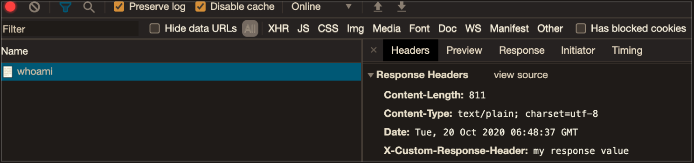

# Traefik V2 with minikube

Example of working with Traefik middleware

## Installation & Run
Checkout
```
$ git clone https://github.com/turneps403/helmfile-traefik-v2-minikube.git
$ cd helmfile-traefik-v2-minikube
```
Start minikube
```
$ minikube start --memory=8192 --cpus=2 --vm=true
```
Apply all manifests and check what you get
```
$ helmfile sync
$ kubectl get all --all-namespaces
```
Check list of avaliable services and start `traefikns` with browser
```
$ minikube service list
$ minikube service mytraefik --namespace=traefikns
```

Add path `/whoami` to url of any of opened tabs, check answer (header `X-Custom-Request-Name`) and response headers (header `X-Custom-Response-Header`). That's result of middleware `charts/application/templates/whoami-middleware.yaml` working.




Checking Traefik dashboard:
* enable nginx ingress (native for minikube)
* add minikube ip to `/etc/hosts` with predefined domain
* check dashboard on `http://traefik-ui.minikube/dashboard/`
```
$ minikube addons enable ingress
$ echo "$(minikube ip) traefik-ui.minikube" | sudo tee -a /etc/hosts
# see result on http://traefik-ui.minikube/dashboard/
```


## Shutdown
```
$ helmfile destroy
$ minikube stop
$ minikube delete
```
